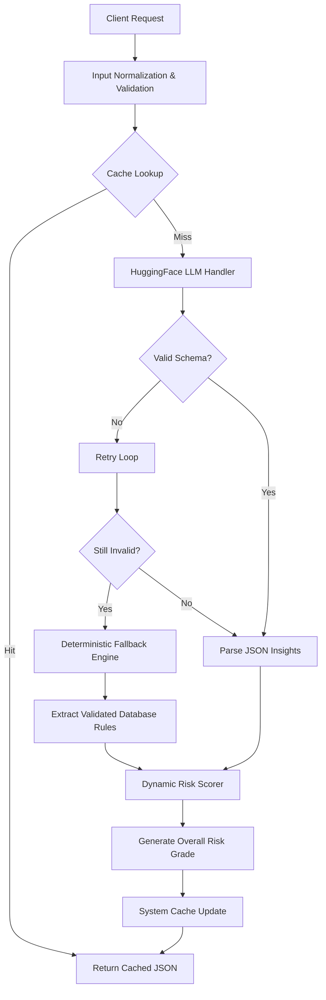

<div align="center">
  <h1>EvoDoc 🧬💊</h1>
  <p><strong>Clinical Drug Safety & Pharmacovigilance Engine</strong></p>
  <p><em>A state-of-the-art LLM-first healthcare API with guaranteed deterministic fallbacks.</em></p>
</div>

<div align="center">


</div>

---

## 🚀 Overview

**EvoDoc** evaluates complex multidrug regimens to ensure patient safety. Instead of relying solely on stochastic LLM generations which can hallucinate, EvoDoc employs an advanced dual-pipeline architecture. 

It consults strict, structured output from an LLM (such as BioMistral or Med42) and, upon failure, drops into a **Rule-Based Deterministic Fallback Engine**, ensuring total safety. 

## 🛡️ Key Features

- **Drug-Drug Interaction Detection** — Pairwise analysis using highly specific clinical rules.
- **Cross-Reactivity & Allergy Detection** — Natively resolves drug class mappings (e.g., `Penicillin` ➡️ `Amoxicillin`, flagging it as **Critical**).
- **Patient Contraindication Checking** — Cross-references patient organ function and health conditions against severe risks.
- **Dynamic Risk Scoring** — Calculates normalized risk mapped directly to **low, medium, or high** severities utilizing medical weight algorithms.
- **Deterministic Cache Layer** — SHA-256 hashed keys based on input drug combinations yield instantaneous `cache_hit` architectures for sub-millisecond response times.
- **Self-Healing LLM Pipelines** — Incorporates smart JSON parsing and automated retry-loops to heal broken markdown blocks or LLM hallucinations natively.

---

## 📐 Architecture & Flow

The entire system's logic flows down completely autonomously, guaranteeing a sub-3 second SLA for medical practitioners.



---

## ⚡ Quick Start

### 1. Install Environment

```bash
# Clone the repository
git clone https://github.com/evodoc/evodoc-engine.git
cd evodoc-engine

# Install required dependencies
pip install -r requirements.txt
```

### 2. Set Up Environment Variables

```bash
cp .env.example .env
```
> **Note**: Even without API keys (`HF_API_KEY`), the engine automatically scales back gracefully to the deterministic fallback rule engine. You never lose connectivity.

### 3. Spin Up The API
```bash
python main.py
```
> The API will immediately boot and listen on `http://127.0.0.1:8000`. Navigate to `/docs` for full Swagger OpenAPI interactive documentation.

---

## 🔌 API Reference 

### `POST /analyze`

Analyzes current medicines combined with patient history.

**Request Payload:**
```json
{
  "medicines": ["Warfarin", "Aspirin", "Ibuprofen"],
  "patient_history": {
    "age": 45,
    "weight_kg": 85,
    "conditions": ["hypertension"],
    "allergies": ["penicillin"],
    "current_medications": ["Lisinopril"],
    "past_medications": [],
    "past_adverse_reactions": [],
    "renal_impairment": false,
    "hepatic_impairment": false,
    "pregnancy": false
  }
}
```

**Response Payload:**
```json
{
  "interactions": [
    {
      "drug_a": "Ibuprofen",
      "drug_b": "ACE Inhibitors",
      "severity": "high",
      "mechanism": "Combining NSAIDs with ACE inhibitors reduces glomerular filtration...",
      "clinical_recommendation": "Avoid concomitant use if possible...",
      "source_confidence": "high (clinical rule)"
    }
  ],
  "allergy_alerts": [],
  "safe_to_prescribe": false,
  "overall_risk_level": "high",
  "requires_doctor_review": true,
  "source": "fallback",
  "cache_hit": false,
  "processing_time_ms": 114
}
```

---

## 📈 Advanced Risk Scoring 

The backend algorithm is strictly tuned for patient safety. Weights are mapped and evaluated automatically scaling to a 0-100 system.

| Medical Vector          | Risk Penalty |
|-------------------------|--------------|
| **Critical Allergy**    | `+40 points` |
| **High Interaction**    | `+30 points` |
| **Medium Interaction**  | `+15 points` |
| **Low Interaction**     | `+5 points`  |

**Output Severities**:
- **0.0** ➡️ `low` risk (`safe_to_prescribe` = true)
- **30.0** ➡️ `medium` risk (`safe_to_prescribe` = true)
- **60.0+** ➡️ `high` risk (`safe_to_prescribe` = false, triggers `requires_doctor_review`)

---

<br>
<p align="center">
  Built securely for modern clinical deployment.<br>
  <em>Never substitute code for professional medical advice.</em>
</p>
